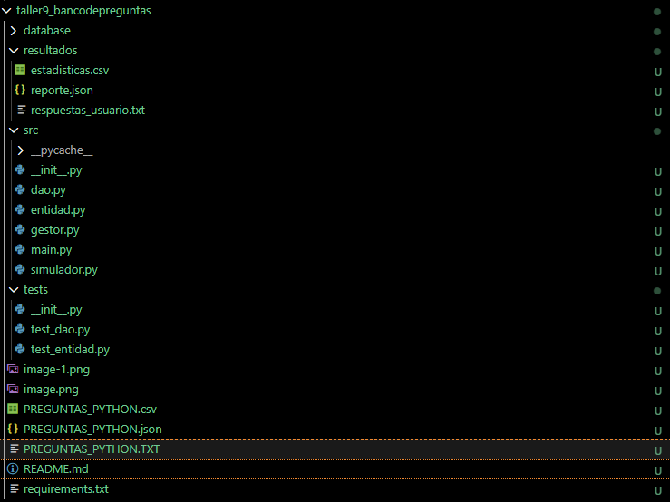
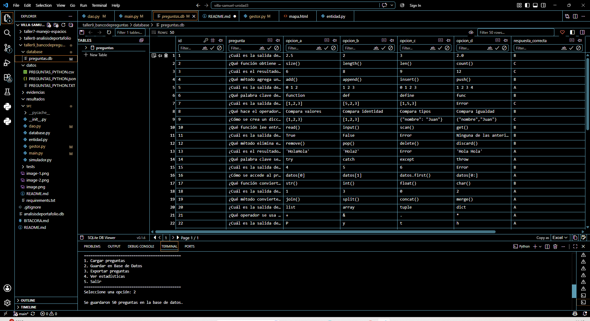
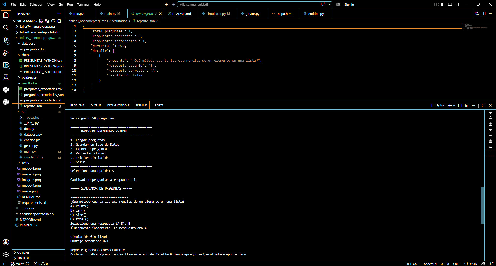
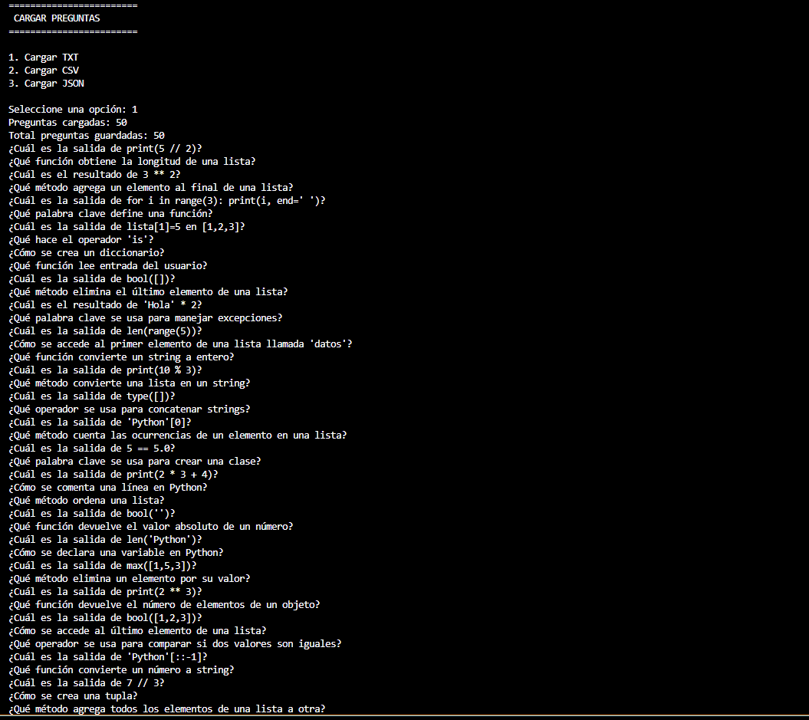
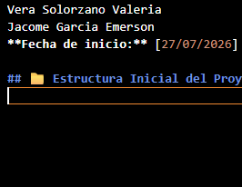
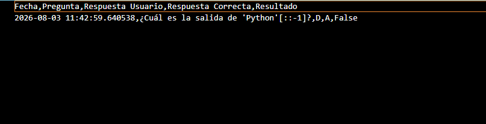
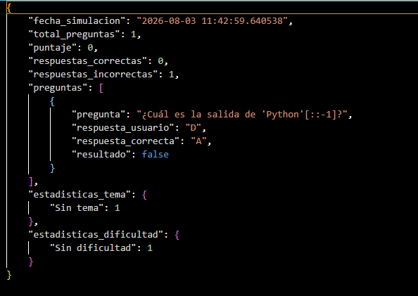
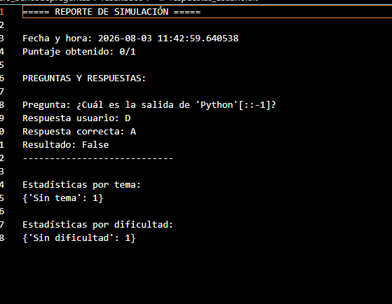
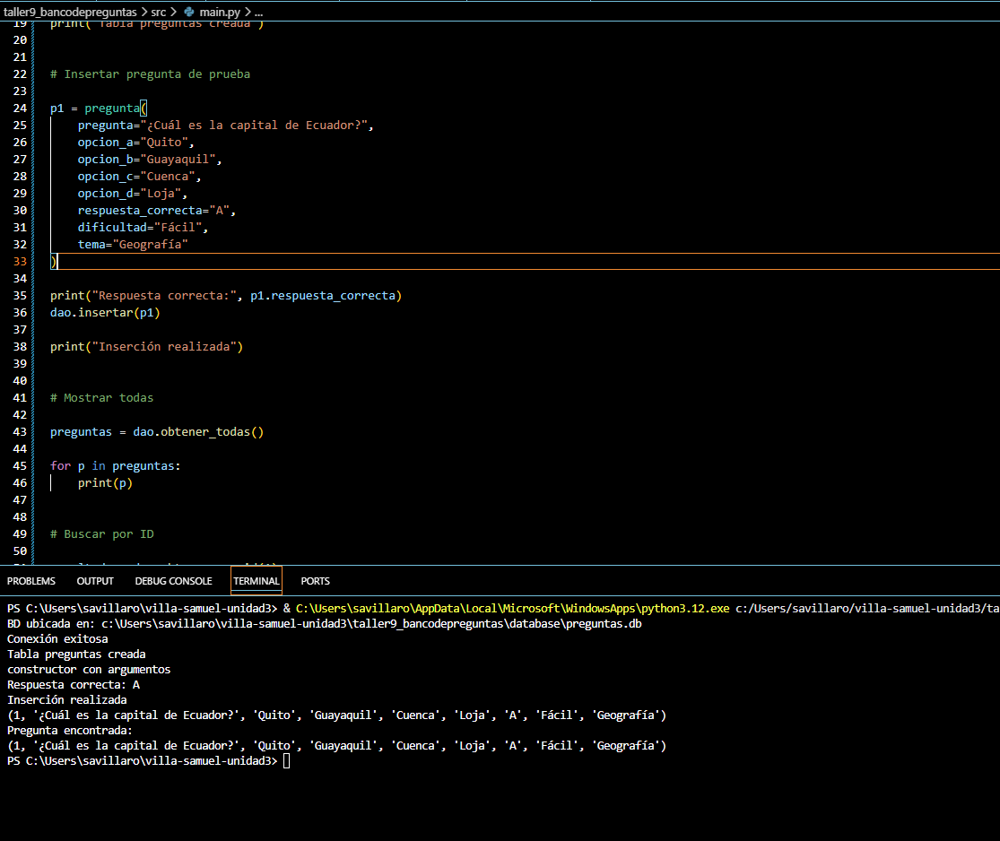
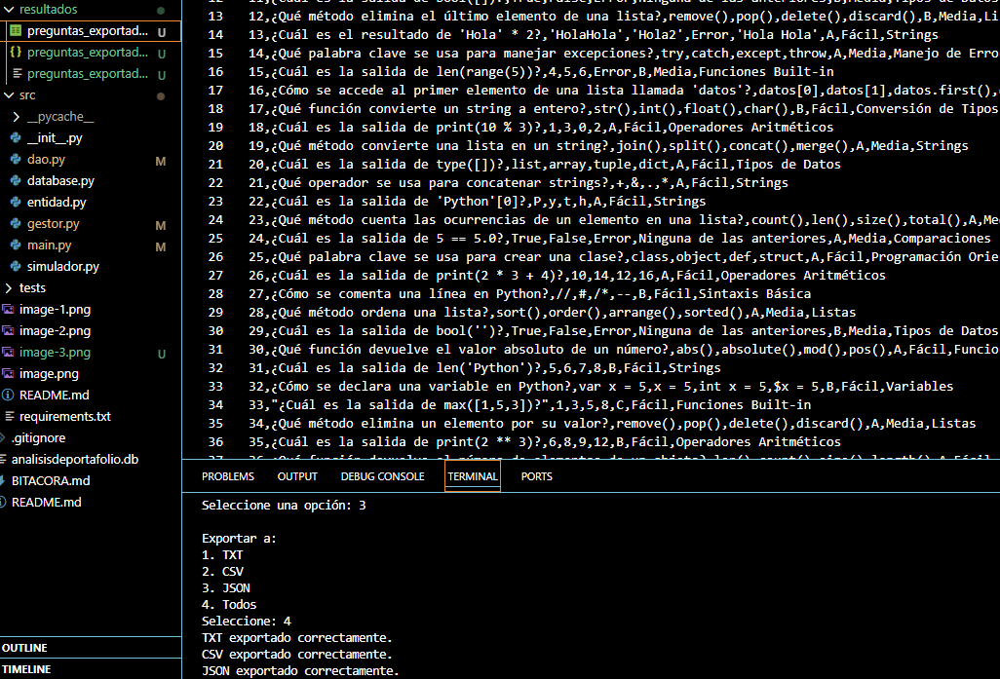

# 📚 Sistema de Preguntas y Respuestas - Proyecto Taller X

## 👥 Integrantes del Grupo
- [Samuel Villa] - [0930563440]
- [Emerson Jacome] - [0930739909]
- [Valeria Vera] - [0930440383]
#### **Fecha de inicio:** [27/07/2026]
#### - Entrega: [03/08/2026]

## 📝 Descripción del Proyecto

El proyecto consiste en el desarrollo de un sistema de **Banco de Preguntas en Python**, diseñado para administrar, almacenar y evaluar preguntas de manera interactiva.

El sistema permite cargar preguntas desde archivos TXT, CSV y JSON, guardarlas en una base de datos SQLite y gestionarlas mediante diferentes módulos utilizando programación orientada a objetos.

Cuenta con funcionalidades para visualizar preguntas, consultar estadísticas por tema y dificultad, realizar simulaciones de evaluaciones con selección aleatoria de preguntas, validar respuestas, calcular puntajes y generar reportes de resultados en formatos TXT, CSV y JSON.

La aplicación fue desarrollada aplicando una estructura modular con separación de responsabilidades entre la entidad de preguntas, acceso a datos (DAO), gestor de información y simulador, además de incluir pruebas unitarias para verificar el correcto funcionamiento del sistema.

## 🛠️ Tecnologías Utilizadas
- Python 3.8+
- SQLite3
- Git

## 📁 Estructura Inicial del Proyecto

## 📄 Archivos de Preguntas Generados
- ✅ preguntas.txt (50 preguntas)
- ✅ preguntas.csv (50 preguntas)
- ✅ preguntas.json (50 preguntas)

## 🗄️ Base de Datos SQLite
- ✅ Tabla 'preguntas' creada
- ✅ Conexión exitosa
- ✅ Métodos CRUD implementados

## 📥 Carga de Datos desde Archivos
- ✅ Carga desde TXT: 50 preguntas cargadas
- ✅ Carga desde CSV: 50 preguntas cargadas
- ✅ Carga desde JSON: 50 preguntas cargadas

## 💾 Guardado en Base de Datos
- ✅ 50 preguntas guardadas en SQLite
- ✅ Exportación a TXT desde BD
- ✅ Exportación a CSV desde BD
- ✅ Exportación a JSON desde BD

## 🎮 Simulador de Evaluación
- ✅ Selección aleatoria de preguntas
- ✅ Interacción con usuario
- ✅ Validación de respuestas
- ✅ Cálculo de puntaje

## 📊 Generación de Reportes
- ✅ Reporte TXT generado
- ✅ Reporte CSV generado
- ✅ Reporte JSON generado

## ✅ Pruebas Finales
- ✅ Pruebas unitarias pasadas
- ✅ Integración completa verificada
- ✅ Manejo de errores implementado

## 📝 Conclusiones

### Resumen del trabajo realizado

Durante el desarrollo del proyecto se implementó un sistema de banco de preguntas en Python, permitiendo cargar preguntas desde archivos TXT, CSV y JSON, almacenarlas en una base de datos SQLite y gestionarlas mediante una arquitectura organizada por módulos. 

Se desarrollaron componentes para la entidad de preguntas, acceso a datos mediante DAO, gestión de información, simulación interactiva de evaluaciones, validación de respuestas, cálculo de puntajes y generación de reportes en formatos TXT, CSV y JSON.

Además, se implementó un menú principal para facilitar la interacción con el usuario, manejo de errores y pruebas unitarias para verificar el correcto funcionamiento de los módulos principales.

### Lecciones aprendidas

Durante la realización del proyecto se reforzaron conocimientos de programación orientada a objetos en Python, manejo de archivos, conexión con bases de datos SQLite y organización de proyectos mediante separación de responsabilidades.

También se aprendió la importancia de realizar validaciones, crear pruebas unitarias y mantener una estructura clara del código para facilitar el mantenimiento y futuras modificaciones.

### Mejoras futuras

Como mejoras futuras se podría implementar una interfaz gráfica para mejorar la experiencia del usuario, agregar un sistema de usuarios con historial de evaluaciones, incluir más formatos de importación y exportación, y desarrollar un sistema de preguntas con diferentes niveles de dificultad adaptativos.

También sería posible integrar inteligencia artificial para generar nuevas preguntas automáticamente o analizar el rendimiento de los usuarios.